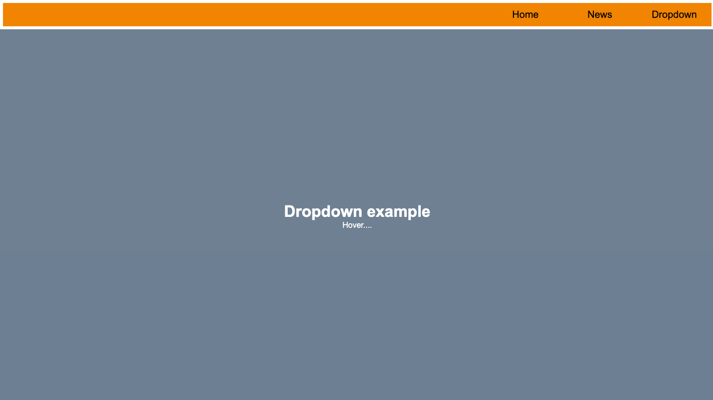
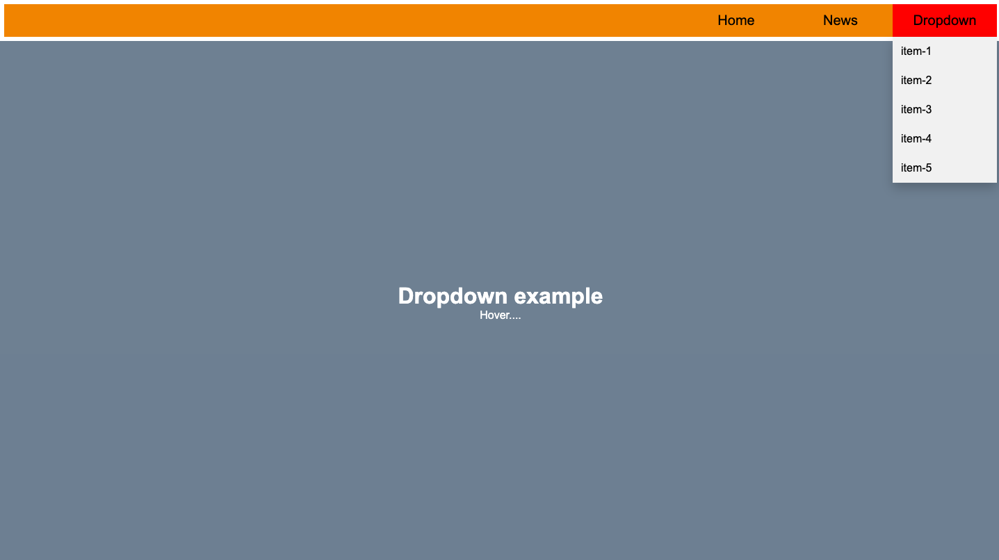

# dropdown-npm-package

javascript dropdown npm package



[Live preview!🔥](https://codepioneer2.github.io/dropdown-npm-package/)

## Installation

Use the node package manager [npm](https://docs.npmjs.com/downloading-and-installing-node-js-and-npm)

```bash
npm install dropdown-js
```

## Contributing

Pull requests are welcome. For major changes, please open an issue first
to discuss what you would like to change.

Please make sure to update tests as appropriate.

## License

[MIT](https://choosealicense.com/licenses/mit/)
